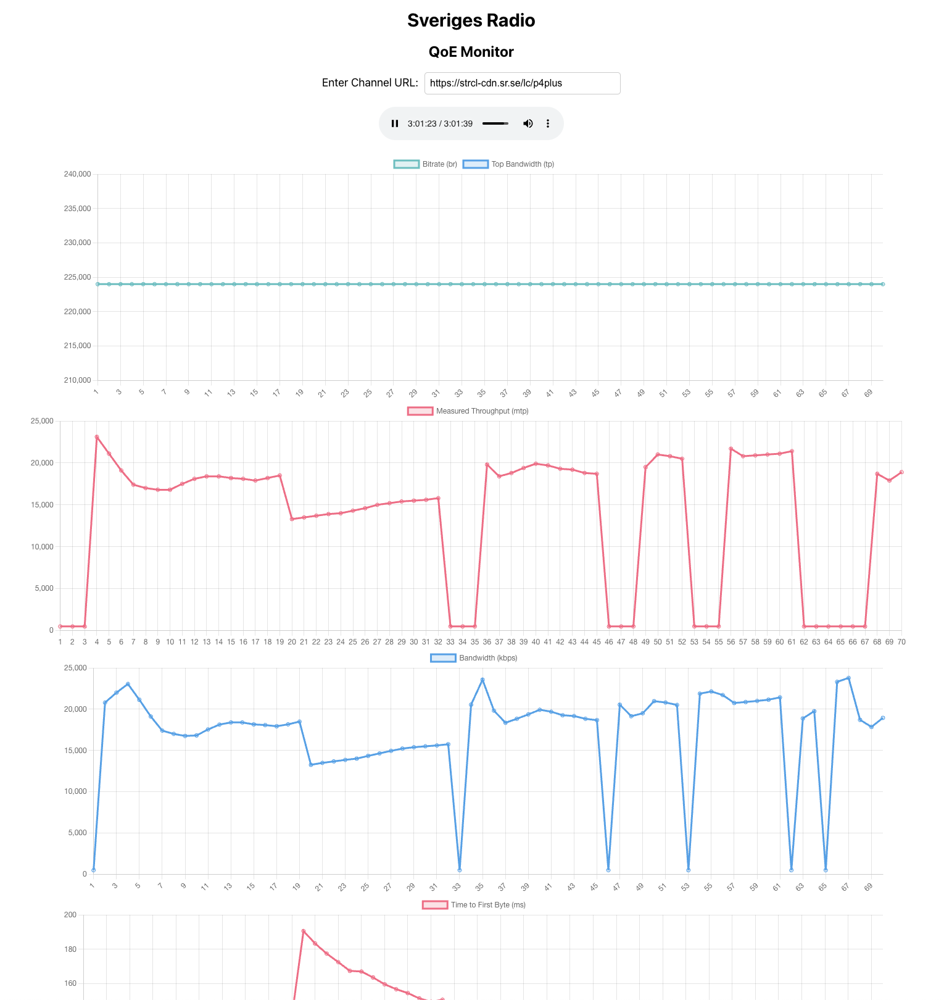

# CMCD MONITOR (Thesis Project)

The QoE Monitor is a prototype of an application to collect QoE metrics on the client
side with help of the media player and plot them in different graphs. This prototype
was then used to execute tests with the goal to get a better understanding on how
different network situations can affect the QoE of the live radio broadcast.

## Implementation

This method involves the development and implementation of a web application created
to extract QoE metrics from the client side. To develop the application, the open
source library HLS.js was installed as a dependency to be used as the media player.
The code for the player was analysed and the metrics chosen were extracted either
from the CMCD data collected by the player or directly from the code of the library.
CMCD, a standardized metadata format, offers insights into what happens on the
client side while playing media from a HLS stream.

Research on QoE made it evident that leveraging CMCD data provides valuable insights
into the user experience and identifies areas for improvement. This standard
is though developed to send the data back to the CDN server, where the data can be
collected an analysed. The application we developed catches the CMCD data found
on the player side before it was sent to the CDN server. The collected data is then displayed
directly on the device running the application and shows the values plotting
them in a graph for better comprehension.

A web application was developed to function as a QoE monitor on the client sides
web application was implemented using React, Node.js and a library called HLS.js that takes a HLS stream and works as a player for the radio broadcast. A
URL to a designated test radio channel was fetched to play the live broadcast from
the application. The protocol used is HLS as mentioned in the literature study.
The application was constructed with the goal to extract CMCD data and other useful
metrics from the client side. This information is to be used to assess the QoE of
the live radio broadcast. By analyzing this data, we aimed to gain a comprehensive
understanding of the QoE and identify potential areas for improvement. By utilizing
this information, we are able to pinpoint specific factors that can influence user
satisfaction and streaming performance.

Other metrics like Bandwidth and Time to First Byte that are not present in the CMCD
standard were collected using the variables available directly in the open source media
player. This required reverse engineering the code for the media player and utilizing
private or hidden variables within the software that were not directly exposed.
Debugging the source code was needed to get a better understanding of the internal
functioning of the media player, and where the required metrics were to be found.
The original code for the HLS.js player presents a set of events that are triggered for
example when a new segment is loaded, called the FRAG_LOADING event. Error
events like the BUFFER_STALLED_ERROR was also used to present the data on
the monitor prototype. The collected metrics were also plotted in graphs in the application.

A library called chart.js was used to plot the metrics data in the application window,
showing the information in real time depending on the actual values extracted
from the player, and showing a dynamical representation of the metrics chosen.
To asses QoE in the application the metrics selected were: Bitrate, Bandwidth, Top
Bandwidth, Measured Throughput, Time to First Bite and a count of buffer stalls (rebuffering). This metrics were adopted after analysing the different metrics that
are used by the standards and commercial tools mentioned in the literature study
and are meant to provide information related to QoE.

The application was also deployed to the KTH Cloud service [29] to be able to be
used from a mobile phone and check for the data in different locations with different
conditions on the mobile coverage that may affect channel capacity and be used to
compare QoE in different situations. Due to the time limit of this study the related
tests were realized only once.